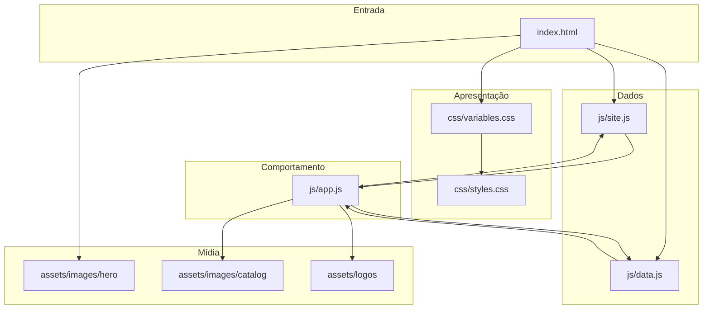

# Arquitetura

Site estático (HTML + CSS + JS) para vitrine e captação de leads da loja **Super Car**. Sem bundler e sem backend no repositório atual.

## Camadas

## Responsabilidades por arquivo

### `index.html`
- Estrutura semântica das seções (hero, estoque, FAQ, depoimentos, contato)
- Pontos de ancoragem e acessibilidade básica (`aria-*`, `dialog`, `details`)
- Referências aos estilos e scripts

### `css/variables.css`
- Design tokens: cores, tipografia, espaçamentos, duração do marquee
- Fonte única de verdade visual — evitar hardcode de tokens em `styles.css`

### `css/styles.css`
- Layout, componentes e estados da interface
- Responsividade e `prefers-reduced-motion`

### `js/site.js`
- NAP e canais (telefone, WhatsApp, endereço, e-mail LGPD)
- Flag `demoNotice` para banner de demonstração

### `js/data.js`
- Array `CARS` (catálogo)
- Paths locais em `assets/images/catalog/`
- Fallback de imagem (`CAR_IMAGE_FALLBACK`)

### `js/app.js`
- Hidrata contato + JSON-LD a partir de `SITE`
- Filtros (busca, marca, categoria, preço)
- Render do catálogo e modal de detalhe (foco/trap)
- Marquee de marcas (CDN Simple Icons + logo local Lexus)
- Formulário → WhatsApp (`wa.me`)
- Menu mobile

## Fluxo do catálogo

1. Usuário altera busca/filtros
2. `app.js` filtra `CARS`
3. Cards são renderizados com `image` local (`assets/images/catalog/...`)
4. Clique abre `#car-modal` com specs e CTA para `#contato`

## Dependências externas

| Recurso | Uso |
|---------|-----|
| Google Fonts (Barlow Condensed, Plus Jakarta Sans) | Tipografia |
| jsDelivr + Simple Icons | Logos do marquee (exceto Lexus local) |
| WhatsApp (`wa.me`) | Conversão do formulário de contato |

## Limites atuais (escopo consciente)

- Sem build step / módulos ES nativos com bundler
- Lead depende de WhatsApp (sem backend de e-mail)
- Sem CMS — estoque editado em `js/data.js`
- NAP e depoimentos ainda com dados de demonstração
